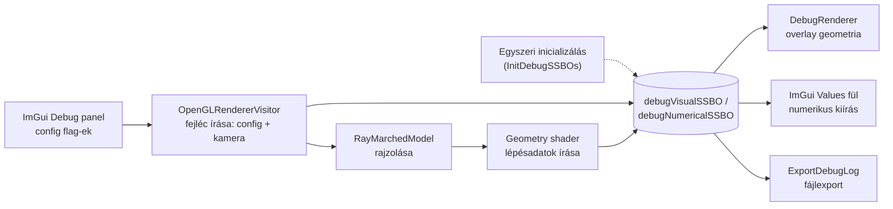

```mermaid
flowchart LR
    Init["Egyszeri inicializálás<br/>(InitDebugSSBOs)"] -.-> SSBO[("debugVisualSSBO /<br/>debugNumericalSSBO")]

    GUI["ImGui Debug panel<br/>config flag-ek"] --> Visitor["OpenGLRendererVisitor<br/>fejléc írása: config + kamera"]
    Visitor --> SSBO
    Visitor --> Draw["RayMarchedModel<br/>rajzolása"] --> GS["Geometry shader<br/>lépésadatok írása"]
    GS --> SSBO

    SSBO --> DR["DebugRenderer<br/>overlay geometria"]
    SSBO --> VT["ImGui Values fül<br/>numerikus kiírás"]
    SSBO --> EX["ExportDebugLog<br/>fájlexport"]

```